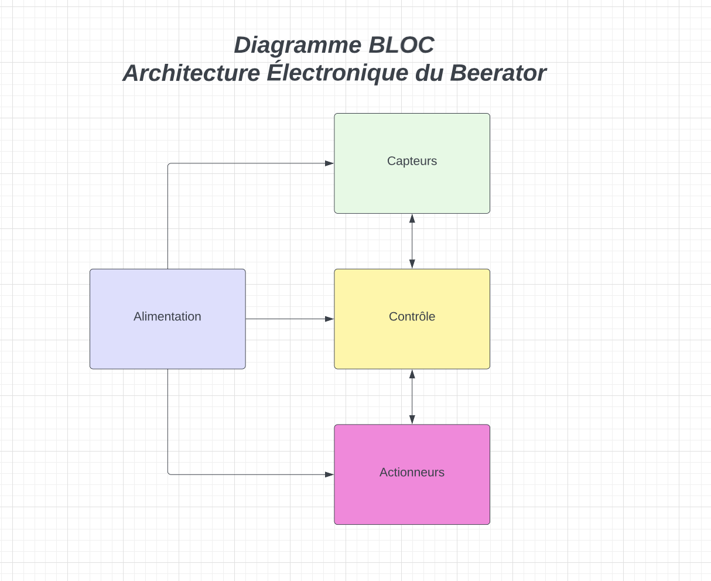

# Diagrams

## Bloc Diagram

Nous avons décidé dans un premier temps de schématiser la partie électronique du projet grâce à une architecture très générale. Nous avons décider de découper le projet en 4 grands Blocs:

- L'alimentation : Ce Bloc va être en charge de fournir de l'énergie à tous les composants de notre robot
- Les capteurs : Ce BloC va être en charge de récolter des données sur l'environement de notre robot
- Les actionneurs : Ce Bloc est responsable de tous les mouvements de notre robot
- Le contrôleur : C'est le cerveau du robot, c'est lui qui permet au robot d'atteindre son objectif 

## Technical Diagram

Here you'll find the latest version of the architectural technic diagramm of the robot.

You can open and modify the diagram on https://app.diagrams.net

