# 
Beerator

## Introduction

Le but du projet est de réaliser intégralement un robot capable de se déplacer, de chercher et d’attraper une canette (de bière ? 😶), relever sa couleur, puis de la déposer dans la zone de couleur correspondante.
Partant d’une liste de tous les composants principaux à employer et d’une proposition de châssis, toutes les étapes sont à réaliser de l’aspect matériel (Modélisation sous logiciel de CAO, soudage des composants) jusqu’à l’asservissement logiciel, en passant par la planification et la réalisation du PCB.

Voici un model 3D de ce à quoi pourrais ressembler le robot:

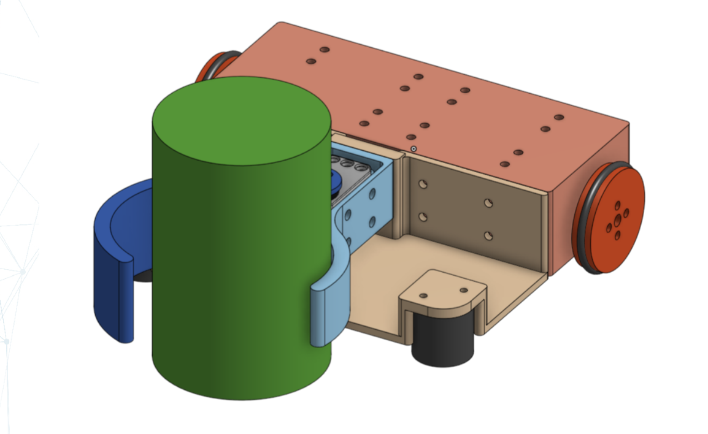

Le travail fut réparti entre les quatre membres de l’équipe, et les responsabilités suivantes furent attribuées:
* Chef de projet / Responsable intégration : Arthur Pellegrin
* Responsable Software : Nassim Rami
* Responsable Hardware : Adrien Lenoir
* Responsable Livrables : Clarisse Cheng

À l’écriture de ses lignes, nous avons planifié tout le projet, réalisé le PCB, designé et imprimé le châssis. Les composants sont en cours de soudage. Il reste ainsi à réaliser l’assemblage des pièces, l’algorithme de fonctionnement du robot, la commande des différents actionneurs, les calculs d’odométrie, et l’asservissement logiciel.

## General Informations

Vous trouverez dans ce repo bon nombre de dossier.

- Nous avons dans un premier temps rassembler les contraintes et les fonctionnalités du robot dans un cahier des charges: [Cahier des Charges](Cahier%20des%20Charges)

- Nous avons ensuite listé toutes les documentations des composants que nous utiliserons pour répondre à notre cahier des charges dans le dossier [Documentation](Documentation)

- Après cela nous avons architecturer la partie électronique du projet dans le dossier [Diagramme](Diagramme)

- Une fois l'architecture satisfaisante nous avons modéliser la carte électronique sous KiCaD vous trouverez le projet dans le dossier [KiCad/Beerator](KiCad/Beerator). Vous pourrez aussi trouver la BOM dans le fichier

- Nous avons en parallele esssayé d'améliorer le modele 3D du robot. Des choix ont été fait afin d'amméliorer la répartition des masses dans le robots et avoir une meilleure disposition des capteurs.

Les différents travaux effectués sont détaillés dans les parties qui suivent.

## Partie I - [partie "II" Clarisse]

## Planification du circuit, Création du PCB

Comme vu précédemment nous avons découpé l'électronique de notre robot en 4 blocs fonctionnels.

Nous devons maintenant créer le schéma électronique de notre carte en respectant cette répartition. Cela n’a pas d'effet sur l'électronique impliqué, mais cela aidera à la maintenabilité et à la lisibilité du projet.

De même, nous traitons chaque composant indépendamment. Ils seront reliés grâce à des labels dans le logiciel * KiCad *.

### ALIMENTATION

Nous avons décidé de connecter la batterie grâce à un JST, ainsi nous pourrons facilement la retirer pour la recharger.
Concernant les régulateurs, nous dimensionnons leurs capacités de découplage en accord avec leurs documentations respectives.

Nous avons ensuite décidé de rajouter des témoins d’alimentation sur la batterie et le 3.3V. Les leds que nous avons choisies consomment 10mA pour fournir une luminosité maximale.
Comme ce sont uniquement des témoins (Nous n’avons pas besoin de beaucoup de luminosité) et que le 3.3V ne peut pas fournir une trop grande intensité nous avons choisis de réduire le courant maximal à 1mA. 
Nous dimensionnons donc les résistances en conséquence, avec une loi d’ohm sachant que les LEDs sont en 3V. 

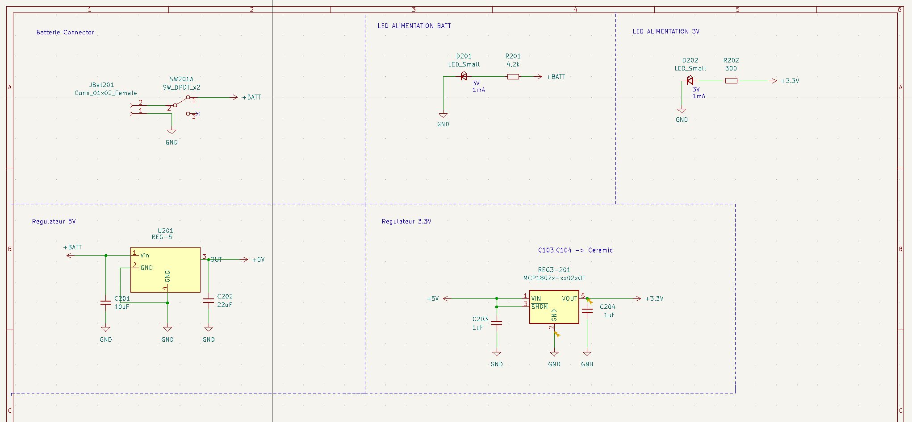

### CAPTEURS

Nous avons décidé de connecter tous nos capteurs grâce à des JST. 
Cela permettra une meilleure modularité physique des capteurs sur le robot.
Cela évite aussi de concevoir une grande carte ou plusieurs cartes, les capteurs disposant presque tous de leur propre carte.

Nous avons quand même dû ici respecter la géométrie des capteurs afin que les JST correspondent aux bonnes I/O des cartes électroniques des capteurs.

Des résistances de Pull-Up ont dû être ajoutées, pour l’I2C car cela est nécessaire pour que ce protocole fonctionne correctement.

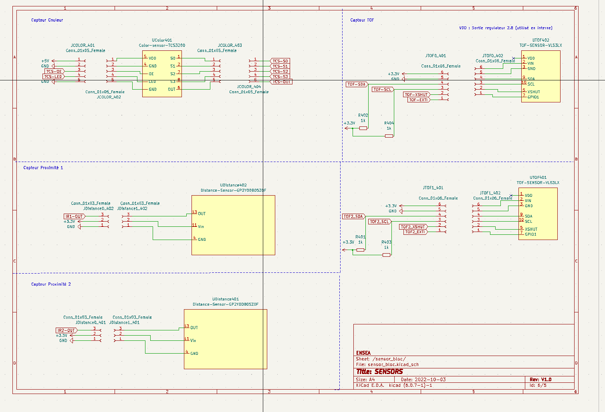

### ACTIONNEURS

Nous avons 3 actionneurs - 2 MCC et 1 Servomoteur.

Les MCC sont commandés par des Drivers et leurs capacités de découplage.
Cette partie du projet est assez délicate. Nous décidons donc de mettre des Solder Jump afin de pouvoir tester nos signaux avant de les connecter aux moteurs.

Le Servo quant à lui suit un protocole particulier, il sera branché sur un port USART en mode Half-Duplex du uP nécessitant une résistance de Pull-Up.

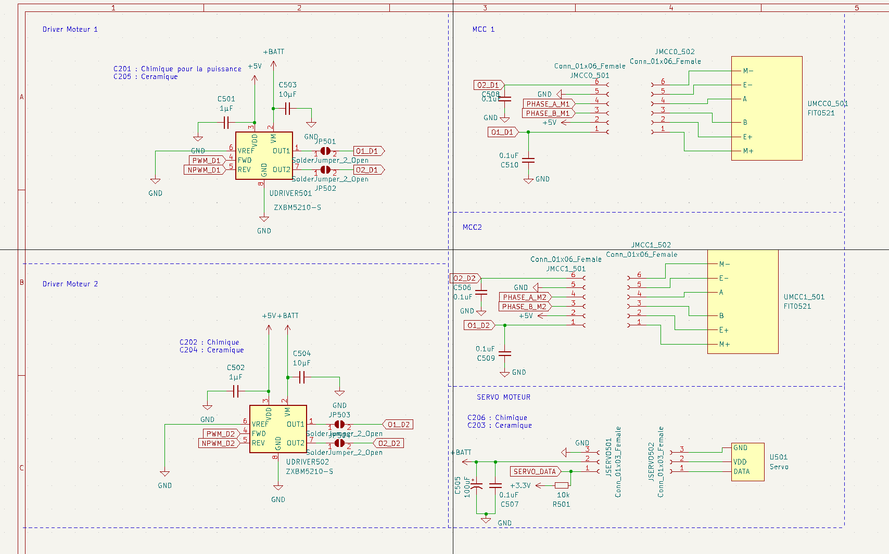

### CONTRÔLEUR

Jusqu’ici tous les modèles électroniques et les placements de toutes les I/O étaient imposés par les constructeurs.

Nous modélisons le microcontrôleur avec ses 64 broches. 
Ensuite nous avons dû brancher tous nos composants à notre microcontrôleur.

Nous avons mis un point d’honneur à optimiser le choix des broches en suivant un protocole bien particulier: 
Regrouper au maximum les broches étant reliées à un même composant
Organiser les broches de manière à minimiser les croisements lors du routage
Segmenter les sous-circuits
Prendre en compte les problèmes de compatibilité électgromagnétique

Grâce au logiciel STM32CubeMx nous avons pu placer les broches sur des pins répondant aux besoins.

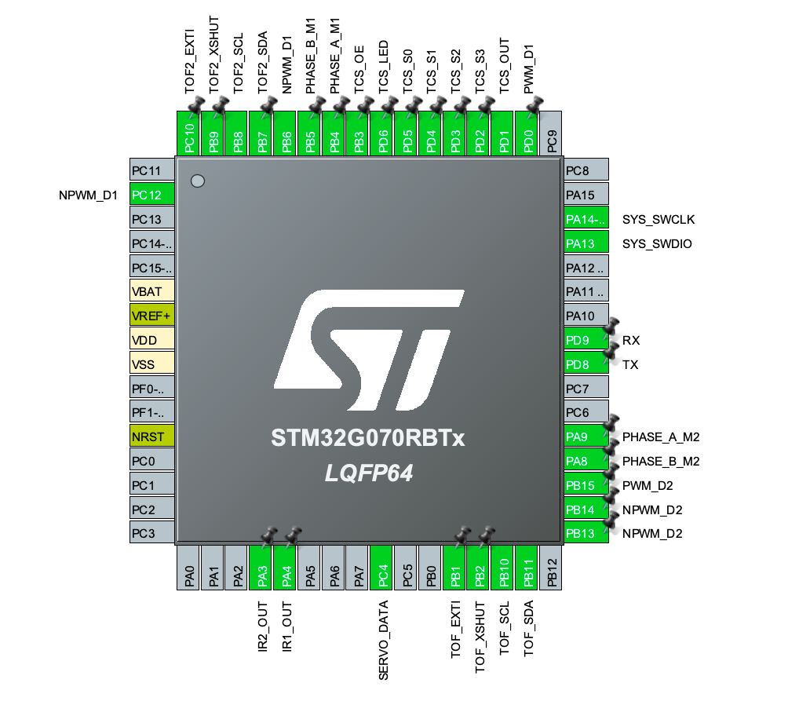

Nous devons aussi alimenter le STM32 et il ne faut surtout pas oublier les capacités de découplage car l’alimentation doit être la plus stable possible.

Nous choisissons aussi de rajouter un Quartz externe, car l’horloge est plus précise.

Il ne faut pas oublier de rajouter, les branchements pour le STLink car c’est lui qui nous permettra de programmer le STM32.

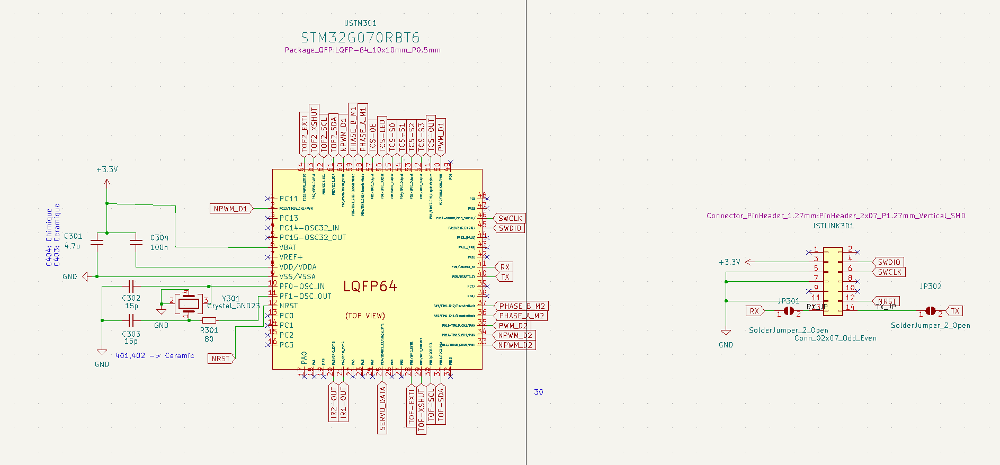

Enfin nous réalisons une analyse électrique de notre circuit pour savoir s’il comporte des erreurs et nous les corrigeons jusqu’à ce qu’il n’y en ai plus.

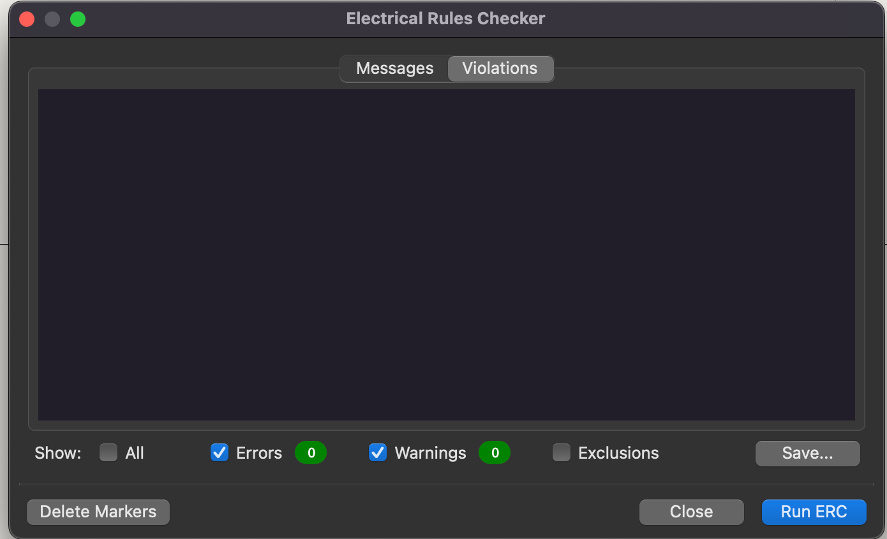

### Production du PCB

La prochaine étape est d’assigner les empreintes correspondants aux composants. Nous utiliserons des composants SMD 0603. Pour les connecteurs nous avons utilisé des connecteurs JST de type JST HX 2.54mm.
On peut remarquer que certains composants ne sont pas assignés, en effet ce sont les composants qui seront directement soudé au capteur donc ils ne doivent pas être présent sur notre PCB

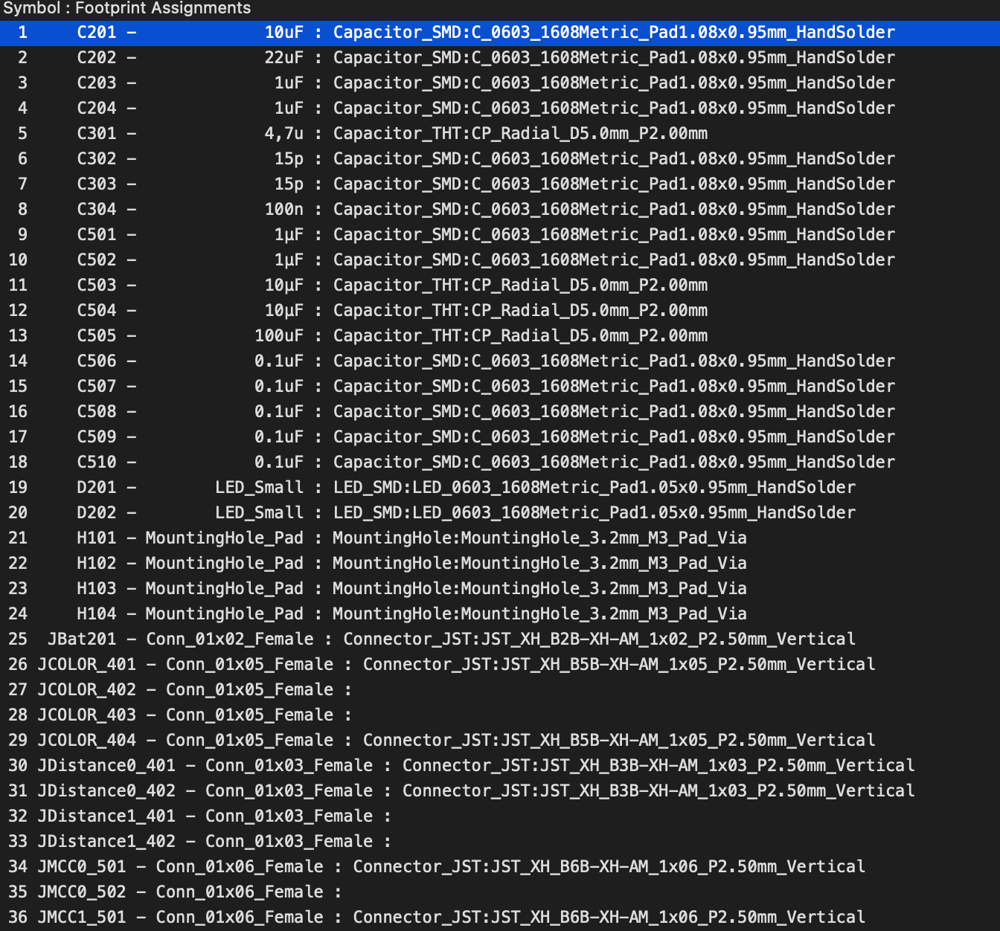

Nous travaillons sur un PCB 4 couches, on décide donc d’y placer 2 plans de potentiels séparés par 2 plans de masses pour d'obscures raisons de CEM.
On peut voir ci dessous le Stack-Up de notre carte

* 5V (Rouge)
* GND (Vert)
* 3,3V (Jaune)
* GND (Bleu)

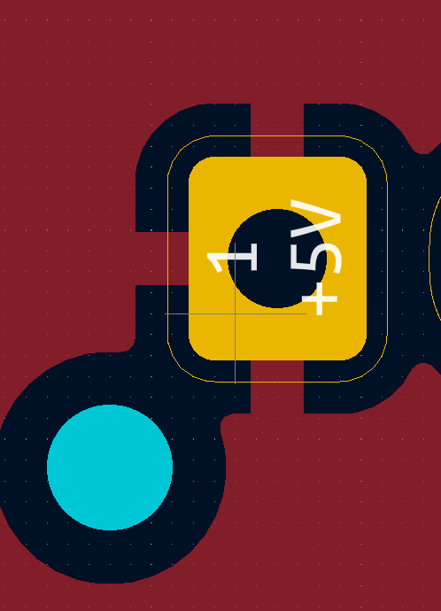

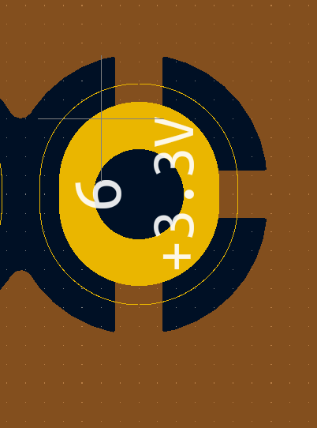

JLC PCB, le fabricant de nos carte nous impose aussi des contraintes de conception que nous devons renseigner.

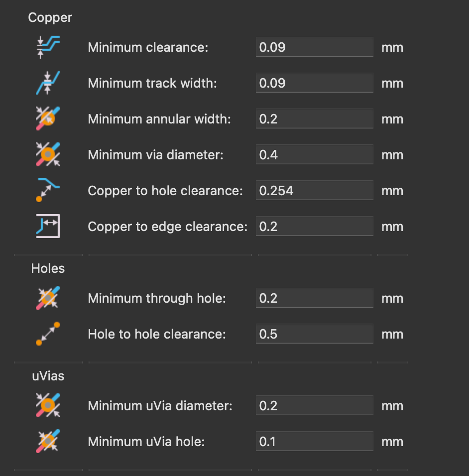

La prochaine est le placement des composants sur le PCB.
Nous essayons de regrouper les composants au maximum par groupe pour que le routage soit le plus simple possible

On décide aussi de placer le STM32 au centre car c’est lui qui possède le plus de connexion.

On voit ci dessous en vert tous les composants relatif au contrôle, en rouge tous le bloc actionneurs, en bleu le bloc alimentation et en jaune le bloc capteur

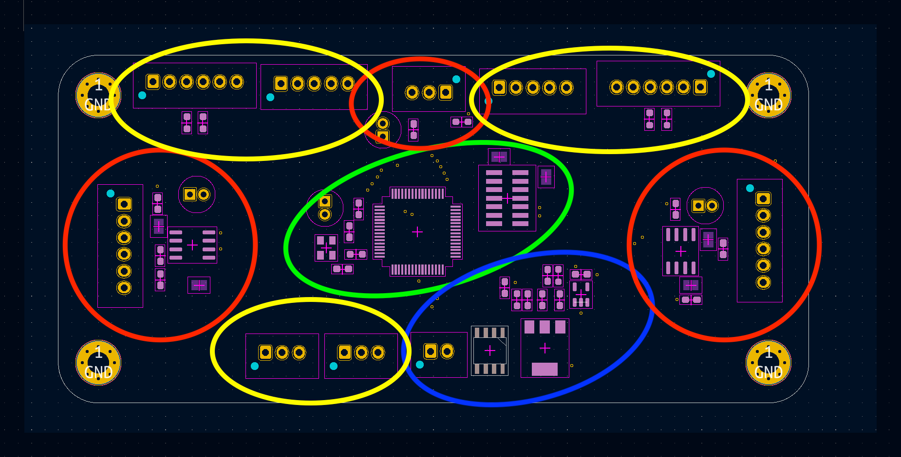

Nous relions ensuite tous les composants électriquement. Nous veillerons aussi à utiliser les pistes les plus larges possible surtout pour la partie puissance. 
Cela permet de laisser passer le courant nécessaire et d’éviter des problèmes de CEM.

Quelques règles de CEM que nous nous efforçons de respecter : 
Pas d’angle à 90º
Les signaux à haute fréquence ne doivent pas se croiser, et les pistes doivent être le plus court possible
Il faut essayer de respecter une distance entre les pistes

Voici ce à quoi ressemblent nos deux plans avec des pistes.

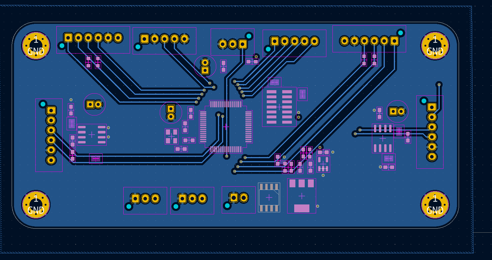
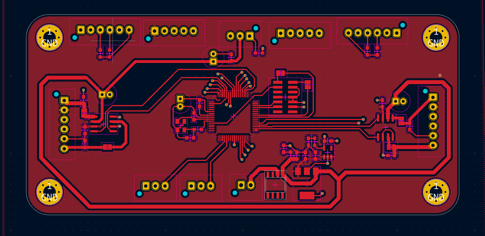

Et enfin notre carte modélisé en 3D

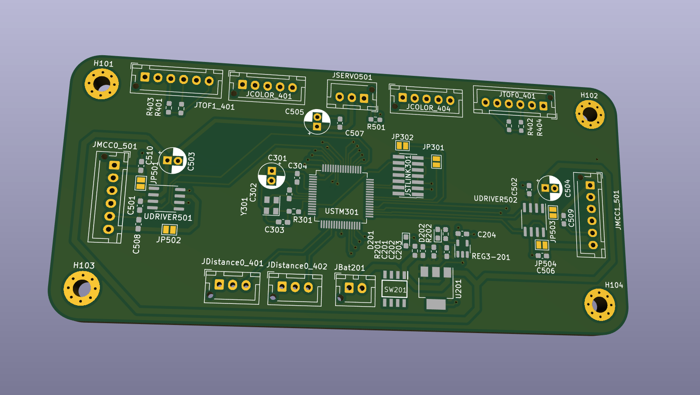

## Capteurs, spécificités software

Dans cette partie, on se basera sur le choix des composants et leur protocole de communication ainsi que leur fonctionnalité pour atteindre les objectifs demandés par le cahier de charge afin que le robot puisse fonctionner correctement.

### TCS3200 - Capteur de Couleur

Le capteur VEML3328 détecte les couleurs rouge, le vert, le bleu en incorporant des photodiodes, des amplificateurs et des circuits analogiques/numériques dans une seule puce CMOS. Avec ce capteur, la luminosité et la température de couleur d'un rétroéclairage d'affichage peuvent être ajusté en fonction de la source de lumière ambiante, et il peutdifférencier les environnements d'éclairage intérieurs des environnements d'éclairage extérieurs.Il existe une relation entre la sortie et l'intensité lumineuse. La gamme de  sortie est typique de 2hz à 500Khz.
Ce dispositif utilise une communication I2C qui convient à notre module pour son fonctionnement correct.

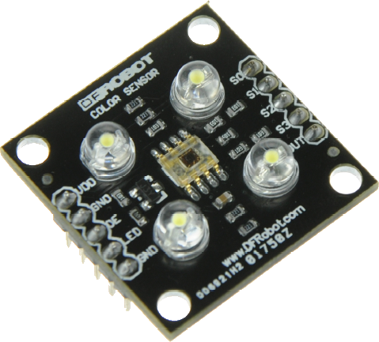

#### Calibration

Pour calibrer le capteur, nous avons besoin d'un objet blanc.On place un objet blanc près du capteur. Après le calibrage, si on garde l'objet blanc devant le capteur, on voit la valeur de 255 pour chacune des trois couleurs rouge, verte et bleue. La fonction Calibrate puis on crée une fonction Calibrate() qui  calcule et stocke les changements maximum et minimum de la fréquence de sortie du capteur dans un environnement non coloré et de couleur blanche. Ensuite,on mappe la plage de changement de couleur sur 0-255 .

### VL53L0X - Capteur de distance TOF

Il s'agit d'un capteur ToF (Time-of-Flight), c'est-à-dire que la distance est mesurée en mesurant le temps de vol. Le capteur vérifie combien de temps il faut à la lumière pour atteindre l'objet, rebondir dessus et revenir au capteur de réception (Réflexion). Le capteur communique avec l'hôte via l'interface I²C. Outre les broches de bus standard, une sortie d'interruption et une entrée pour l'arrêt du capteur sont également disponibles.

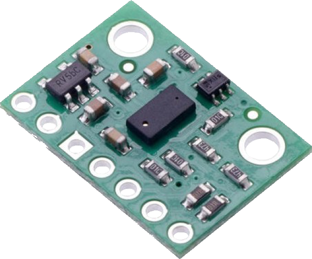

#### Programmation

ST ajoute une bibliothèque complète au capteur  Elle contient tout ce qui peut être fait avec le système.
On a testé la bibliothèque pour extraire les données du capteur sauf que la bibliothèque est universellement écrite et  elle prend donc beaucoup de code,ce qui représente beaucoup de mémoire Flash.
Pour cela on est obligé de créer notre propre drivers pour extraire les données et communiquer avec le capteur.

### Sharp GP2Y0D805Z0F - Capteur de Proximité Infrarouge

Ce capteur de proximité infrarouge de Pololu permet de détecter sans contact tout objet entre 0,5 et 5 cm . Sur la carte électronique,on retrouve 3 broches : la pastille carrée est la masse, la pastille du milieu est l'alimentation Vin (entre 2.7 et 6.2 V) et la dernière pastille est la sortie du capteur de proximité infrarouge.On peut améliorer la performance du capteur en plaçant une capacité (>10uF) entre l'alimentation et la masse.

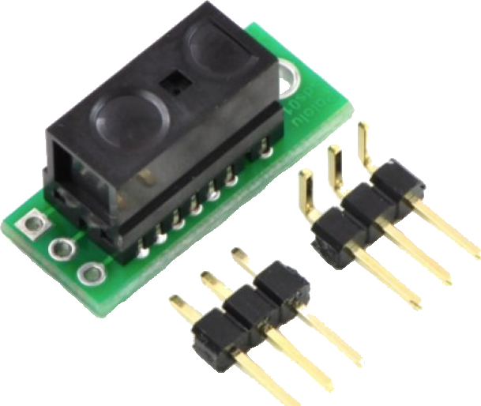

## Architecture matérielle, Modélisation

### Généralités

Afin de pouvoir intégrer les éléments imposés du projet sur le robot, nous avons dû modéliser un châssis qui reprend la forme proposée en incluant les capteurs. Pour maximiser la fiabilité de ce robot en termes de trajectoire et faciliter sa commande/son asservissement, nous avons voulu modifier sa géométrie en plaçant entre autres son centre de gravité en aval de son centre de poussée (pour la marche avant), et en rendant quasi parfaitement symétrique el robot, que sa pince soit ouverte ou fermée. Ainsi les batteries se retrouvent à l’arrière, les moteurs contrôlent la rotation des roues directement à l’avant, le troisième point d'appui omni-directionnel est juste derrière les batteries, et la pince à l’opposé, tout à l’avant en porte à faux. Elle opère en un mouvement synchronisé de trois mords qui serrent et soulèvent légèrement du sol la canette interceptée, grâce à une légère inclinaison du système, comme on peut le voir ci-dessous.

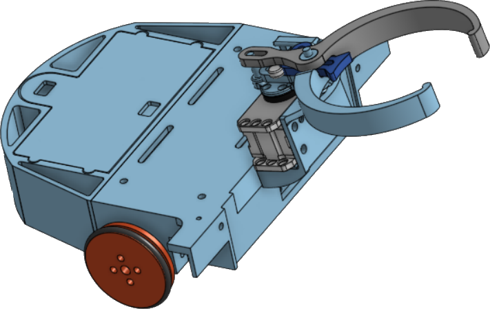

Le tout confère au robot une allure de scorpion.

### Placement des capteurs

Les deux capteurs infrarouges anti-chute sont situés sur les côtés, juste devant les roues, de façon à toujours détecter la chute potentielle à temps et à pouvoir faire revenir le robot sur ses pas si nécessaire.

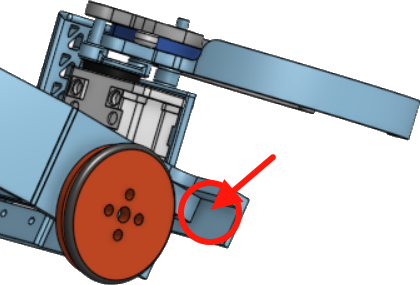

Le capteur de couleur est placé juste sous la pince, avec la même orientation, afin de lire au plus proche la couleur de la canette saisie, car ce type de capteur ne fonctionne pas de façon fiable au delà d’une distance de quelques centimètres.

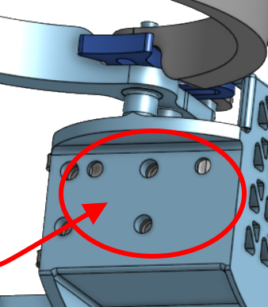

Le capteur de distance ‘TOF’ est quant à lui placé sur un plan vertical, sur le front du robot, afin de lire sans obstruction la distance avec les obstacles/cibles rencontré(e)s.

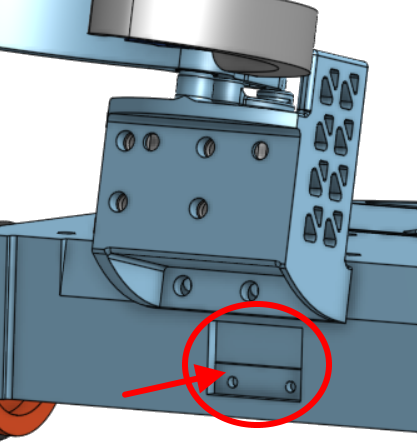

### Dimensions des pièces

Les capteurs et actionneurs utilisés par le robot sont à l’origine de sa géométrie, et dans le souci de bâtir un modèle correspondant au mieux aux critères énoncés plus haut, il fallait à présent recenser les dimensions physiques de chaque élément. Ce recueil apparaît ci-après.

Canette (33 cL standard) | Ø: 66 mm, H: 115 mm
Canette (50 cL standard) | Ø: 66 mm, H: 168 mm
Batterie (avec assez de marge pour les fils) | l: 48 mm; L: 95 mm; H: 15 mm
Moteurs avec codeur (sans l’axe) | Ø: 25 mm, L: 59 mm
Servomoteur (pris aux centres des points de fixation) | l: 24 mm; L: 18 mm; H: 12 mm
Capteur IR | l: 8.9 mm; L: 21.6 mm; H: xx mm
Capteur de couleurs | l: 28.4 mm; L: 28.4 mm; H: xx mm
Capteur TOF | l: 12.7 mm; L: 17.8 mm; H: xx mm
PCB (pris aux centres des points de fixation) | l: 40 mm; L: 100 mm
Bille (Roulement omnidirectionnel) | Ø: 22.9 mm, H: 20.9 mm
Roues avec support | Ø: 40 mm, H: 8 mm

### Cable management

Tous les câbles parcourent le chemin le plus court pour parvenir à la carte, en s'immisçant dans des sillons et fentes prévus à cet effet dans le châssis.

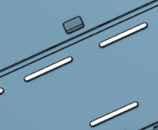
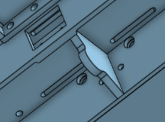

Ainsi on évite les erreurs de branchement, les croisement et les fils trop exposés.

### Le système de pince

Comme expliqué plus haut, la pince s’articule en trois mords synchronisés, deux maintiennent la canette, le troisième la soulève.

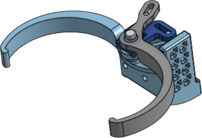
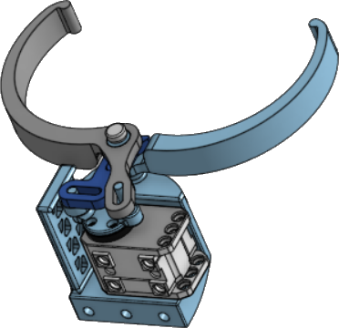

Le servomoteur fait passer la pince entre ses états fermés et ouverts sur une course de 90°. Deux mouvements proches mais opposés en sens ferment les deux crochets de pince arrondis, pendant que la troisième composante de la pince s’avance pour refermer l’emprise du robot sur sa bière et la soulever légèrement du sol, pour la vider pour ne pas qu’elle frotte. Cela peut paraître superflu, mais peut jouer un rôle important sur une surface non plane ou rugueuse.

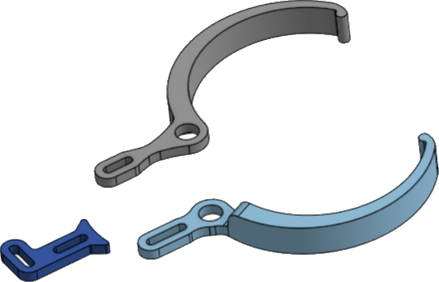

